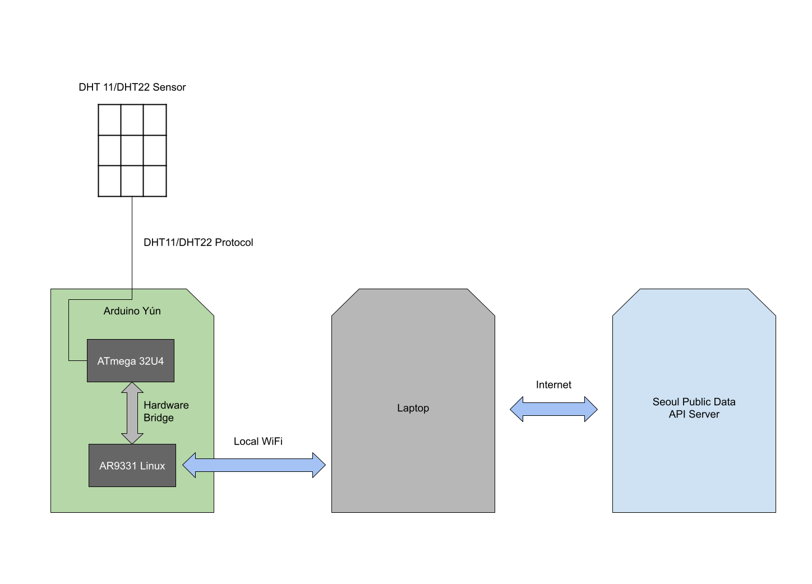

# IoT Data Concatenator

This platform gathers humidity / temperature data with Arduino Yun and traffic data from Seoul City Open API.
Then, combine this data into one CSV file.

To use this script, the Python script and Arduino sketch script should be uploaded on Arduino Yun and be executed.
Python script can be executed via SSH.

Also, HOST in python script for PC should be changed to proper IP address.

Refer to the [schematic file](./docs/Schematic_DHT-Arduino_2021-04-07.pdf) for hardware configuration.

## Project Structure

There are two independent loop.

### Sensor Loop

This loop runs on the ATmega32U4 once every two seconds. In this loop, ATmega continuously get the humidity and temperature data from DHT11/DHT22 sensor and push it into hardware bridge.

### Main Loop

This loop runs on Laptop and also runs once every two seconds. This  loop does the following steps.

1. Request humidity, temperature data from AR9331 on Arduino Yun via local WIFI connection.
2. If required data was received, request traffic data from Seoul public data API server via internet.
3. If both data was received, concatenate the two data with timestamp and append it to CSV file.

## How to Use

1. Connect Arduino Yun and PC to same WIFI network. It is recommended to use PC as hotspot AP and connect Arduino to that.
1. Update required files on Arduino Yun. Sketch file can be uploaded via Sketch IDE and Python script can be uploaded via SCP.
1. Execute Sketch file and python file on Arduino. If you uploaded Sketch file properly, It will be executed automatically, and python file should be executed manually via SSH. (You can set it to be executed automatically when Linux is booted, if you want.)
1. Execute Python script for PC.

Then it will automatically connect to Arduino and get humidity, temperature, traffic data from Arduino and Open API, and generate CSV file containing them with timestamp.

## Challenges

- It is impossible to connect to Arduino Yun with VS Code remote explorer because of the lack of storage space.
  - So file on Arduino Yun only can be edited via vim.
- Installing python3 is also impossible because of same reason.
  - Therefore, only python2 (which is installed by default) can be used.
- Is seems like that Arduino Yun is not connected to WIFI if the given WIFI does not exist when it is booted.
  - Therefore, the WIFI should be prepared before Arduino Yun is booted.

## Notice

- There are two types of link id, `표준링크(Standard link)` and `서울특별시 서비스링크(Service link)`. Seoul public data API server uses the service link.
- There are an mapping table (`.xls` file) in `docs/references`. If you only know the standard link, you should convert it to service link with this table.